เห็นคำว่า Graviton นี่เราไม่ได้หมายถึงแรงโน้มถ่วงควอนตัมแต่อย่างใด แต่เรากำลังพูดถึง AWS Graviton กันอยู่ ซึ่งถ้าเอาแบบง่ายๆ AWS Graviton ก็คือ CPU Arm-based processors ของทาง AWS ซึ่งเป็นหนึ่งใน [AWS custom chips](https://aws.amazon.com/silicon-innovation/) ที่มีจุดเด่นในด้านของราคาต่อประสิทธิภาพ

ปัจจุบันเวอร์ชั่นล่าสุดของ AWS Graviton คือ Generation 4 ที่เพิ่งเปิดตัวกันไปในงาน [AWS re:Invent 2023](https://reinvent.awsevents.com/) ที่ผ่านมา (ขณะนี้อยู่ใน preview สามารถ [signup](https://aws.amazon.com/ec2/instance-types/r8g/) เผื่อทดลองใช้งานได้) ซึ่งมีการปรับปรุงในเรื่องของ performance และ cost-effective ที่มากขึ้น

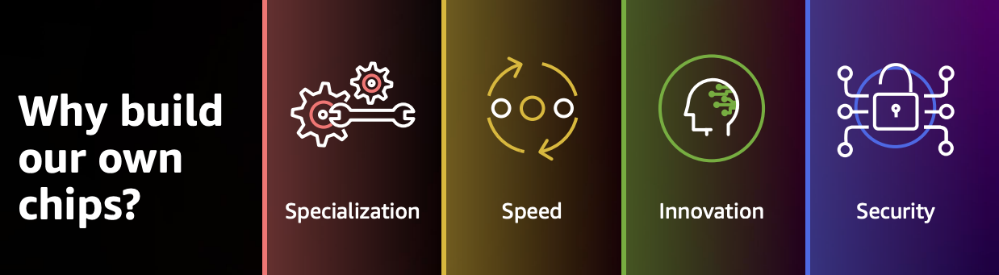
## ประสิทธิภาพของ Graviton
ถ้าถามว่า อะไรที่ทำให้ AWS Graviton แรงกว่า คุ้มกว่า เรามาลองดูรูปนี้กันครับ

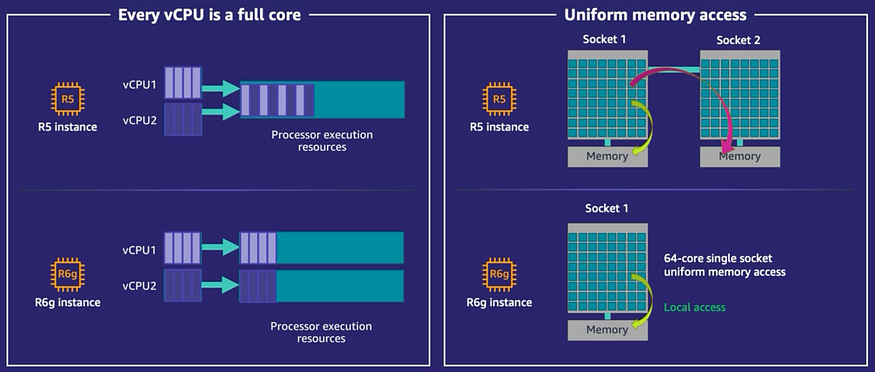

จากรูปนี้เราจะเห็นอยู่สองเรื่องนั่นก็คือ

1. Every vCPU is a full core - หมายความว่าโดยปกติแล้ว vCPU ที่เราเห็นๆกันมันเป็นแค่ thread (logical core) ไม่ใช่ physical core ซึ่งจริงๆแล้วเป็นการทำสิ่งที่เรียกว่า [Simultaneous Multithreading](https://en.wikipedia.org/wiki/Simultaneous_multithreading) หรือ [hyperthreading](https://en.wikipedia.org/wiki/Hyper-threading) ฉะนั้นเวลาที่ต้องประมวลผล workload จำนวนมาก อาจทำให้เกิด latency ขึ้นระหว่าง logical core ด้วยกันเองได้ [(Core and Thread)](https://www.linkedin.com/pulse/understanding-physical-logical-cpus-akshay-deshpande/)

2. Uniform memory access - คือการที่ processor มี local memory เป็นของตัวเอง ไม่แชร์ข้ามระหว่างกัน ทำให้สามารถ access ได้ไวกว่า non-local memory [(Memory Design NUMA)](https://en.wikipedia.org/wiki/Non-uniform_memory_access)

ถ้าหากว่าใครไหวเรื่องพวกนี้แนะนำให้ไปต่อกับ [AWS whitepaper](https://docs.aws.amazon.com/whitepapers/latest/ec2-networking-for-telecom/overview-of-performance-optimization-options.html) อันนี้ได้เลยครับ  
ส่วนตัวผมนั้น ไม่ไหวครับ 🥲

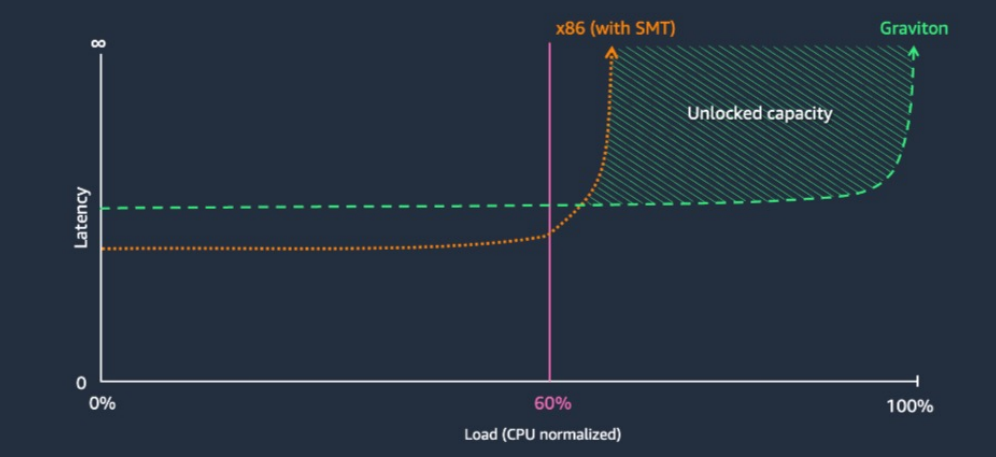

ด้วยสองเหตุผลที่กล่าวไปทำให้เราสามารถรีดประสิทธิภาพของ CPU ได้มากขึ้น แทบจะ 100% กันเลยทีเดียว ต่างจาก x86 ที่จะเริ่มมี Latency มากขึ้นเรื่อยๆเพราะ Physical core ถูกแบ่งกันใช้งาน ทำให้เราต้องมาตั้ง trigger scaling ตั้งแต่เนิ่นๆก่อนที่จะเกิด Bottleneck กันอย่างในปัจุบัน

ถัดไปลองมาดู Benchmark กันบ้างครับ

รูปนี้เป็น [Benchmark](https://www.anandtech.com/show/15578/cloud-clash-amazon-graviton2-arm-against-intel-and-amd/9) ของทาง Anandtech ที่ทำเทียบระหว่าง AWS Graviton 2 กับ x86 ทั้งทางฝั่ง AMD และ Intel ครับ จะเห็นได้ว่าในจำนวนเงิน dollar ที่จ่ายไปเท่ากันนั้น การใช้งาน AWS Graviton สามารถให้ผลลัพธ์ที่ค่อนข้างมากกว่านั่นเอง และหากมาลองดู real world scenario ที่เราใช้กันอย่างเช่น Nginx ก็ยังให้ Requests/Sec ที่มากกว่าเช่นกัน

[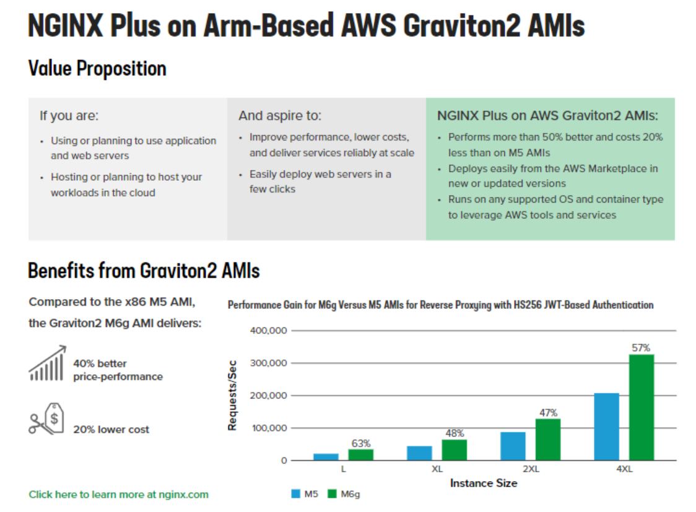](https://www.nginx.com/resources/datasheets/nginx-plus-arm-based-aws-graviton2-amis/)

ลองมาดู feedback จากลูกค้าที่ใช้ AWS Graviton กันบ้างครับ


> "AWS Graviton4 instances are the fastest EC2 instances we've evert tested and are delivering outstanding performance across our most competitive and latency sensitive workloads. we look forward to using Graviton4 to improve player experience and expand what is possible within Fortnite."
> 
> Epic Game

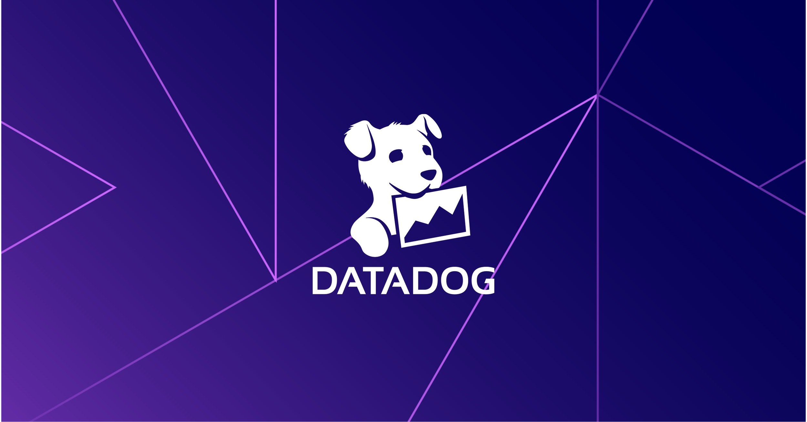

> "Integrating Graviton4-based instances into our environment was seamless and gave us an immediate performance boost out of the box, and we're looking forward to using Graviton4 when it becomes generally available"
> 
> Datadog

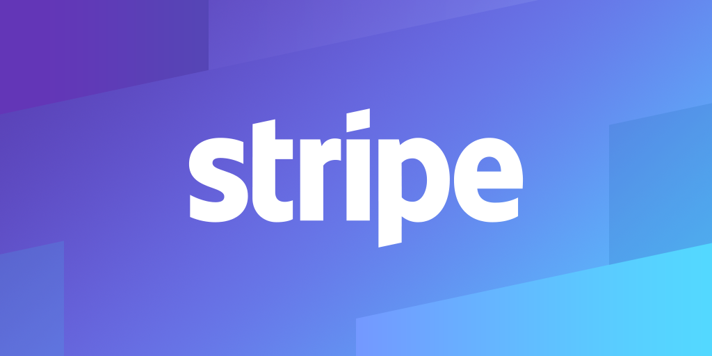

> "Measured up to 50% query performance improvement and 10%-15% reduced error rate (fewer timeouts)"
> 
> Stripe

อันนี้ก็เป็นแค่ตัวอย่างที่เราหยิบยกมาเบื้องต้นแค่นั้น จะเห็นได้ว่าหลายๆบริษัทสามารถนำ AWS Graviton มาใช้เพื่อเพิ่มประสิทธิภาพของระบบได้มากขึ้นเลยทีเดียว ถ้าหากว่าอยากอ่านเพิ่มเติม สามารถเข้าไปดูลูกค้าของ AWS Graviton เต็มๆได้[ที่นี่](https://aws.amazon.com/ec2/graviton/customers/?ec2-instances-customers-cards.sort-by=item.additionalFields.date-added&ec2-instances-customers-cards.sort-order=desc&awsf.success-story-topic=*all&awsf.content-type=*all&awsf.use-case=*all&awsf.processor=*all&awsf.instance-name=*all&awsf.managed-services=*all&awsf.programming-language=*all&awsf.industry=*all&awsf.region=*all&awsf.year=*all)เลยครับ

## การใช้งาน Graviton
เกริ่นกันมาซะขนาดนี้ คิดว่าทุกคนคงอยากจะกระโดดเข้ามาใช้งานเจ้า CPU ตัวนี้ของ AWS กันเป็นแน่แท้ งั้นไม่รอช้าครับ เรามาดูกันดีกว่าว่าก่อนที่เราจะใช้งานเจ้า Graviton นี้ได้ เราต้องเตรียมความพร้อมอะไรกันบ้าง

### 1/ CPU Architecture
เนื่องด้วยความต่างของ CPU Architecture ทำให้เราต้องมีการเตรียมความพร้อมสำหรับการนำ software ไปรันอยู่บน AWS Graviton กันก่อนครับ สามารถเช็คไปทีล่ะข้อได้เลยตามรายการด้านล่างนี้ได้เลยครับ

- Language - ถ้าหากว่าภาษา programming ที่คุณใช้เป็นประเภทที่ต้อง compile ก่อน เช่น C, C++, GO, หรือ Rust ก็สามารถเปลี่ยนมา compile สำหรับ ARM64 Architecture ได้เลยครับ หรือถ้าภาษาที่ใช้เป็น Interpreted หรือ Compiled-bytecode เช่น Python, Java, PHP, Node.js หรือ .NET ก็แค่เปลี่ยนตัว runtime ให้เป็นของ ARM64 ก็เป็นอันเรียบร้อย จริงๆตอนที่เราทำเองอาจจะไม่ได้ง่ายขนาดนั้น ลองเข้าไปอ่านคำแนะนำเบื้องต้นของแต่ล่ะภาษาที่เราใช้งานกันได้เลยครับ
    - [C/C++](https://github.com/aws/aws-graviton-getting-started/blob/main/c-c++.md)
    - [Go](https://github.com/aws/aws-graviton-getting-started/blob/main/golang.md)
    - [Java](https://github.com/aws/aws-graviton-getting-started/blob/main/java.md)
    - [.NET](https://github.com/aws/aws-graviton-getting-started/blob/main/dotnet.md)
    - [PHP](https://github.com/aws/aws-graviton-getting-started/blob/main/php.md)
    - [Python](https://github.com/aws/aws-graviton-getting-started/blob/main/python.md)
    - [Rust](https://github.com/aws/aws-graviton-getting-started/blob/main/rust.md)

และเพื่อความมั่นใจก็ลองไปเช็ค [Known issues](https://github.com/aws/aws-graviton-getting-started/blob/main/rust.md) กันก่อนซักเล็กน้อยเผื่อจะได้ไม่เสียเวลาไปกับปัญหาที่เราอาจจะเจอครับ

- Operating System - ปัจจุบันแทบจะทุก Linux distributions รองรับ ARM64 กันเป็นที่เรียบร้อย ถ้าหากคุณใช้ AMI มาตราฐานอย่าง Amazon Linux, Ubuntu, หรือ Alpine Linux ก็สบายใจได้ แต่ถ้าไม่หรือเป็นมีการปรับแต่งกันขึ้นมาเอง ก็อาจจะต้องไปดู [Operating System](https://github.com/aws/aws-graviton-getting-started/blob/main/os.md) ที่รองรับกันนิดนึงว่ารองรับหรือไม่ครับ

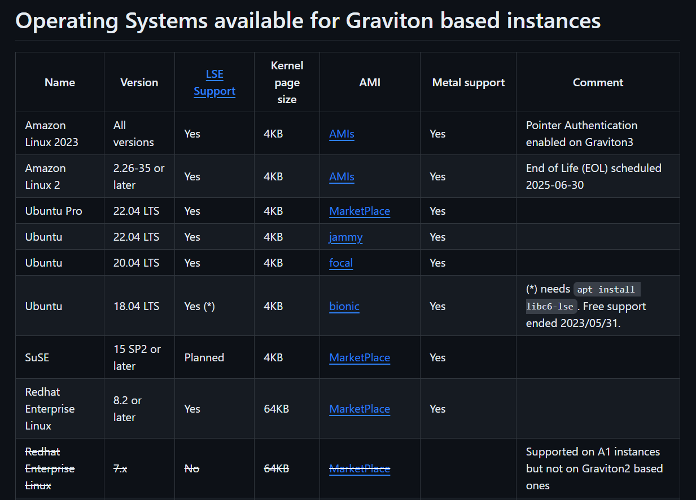

- Version - นอกจากการเปลี่ยนวิธีการ compile ของภาษาที่เราใช้แล้ว เราก็ควรจะอัพเกรดเวอร์ชั่นที่ใช้ให้ใหม่ที่สุดเท่าที่จะเป็นไปได้ด้วยเช่นกัน เพราะในตอนที่ยุคของ ARM computer มาถึง หลายๆภาษาก็เริ่มมีการ optimize ให้เข้ากับ ARM มากยิ่งขึ้น อย่างเช่น [Go version 1.18](https://tip.golang.org/doc/go1.18) ที่มีการปรับปรุงการส่งฟังก์ชั่นเป็นอาร์กิวเมนต์ในรูปแบบใหม่ที่ทำให้ได้ performance มามากขึ้นกว่า 10% นั่นเอง
    [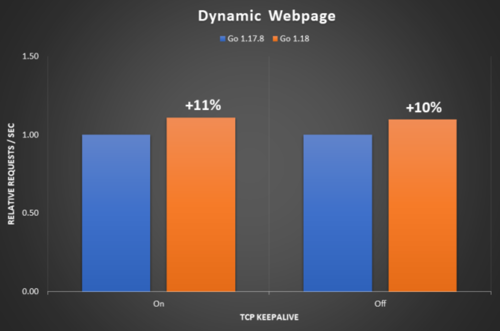](https://aws.amazon.com/blogs/compute/making-your-go-workloads-up-to-20-faster-with-go-1-18-and-aws-graviton/)
    ref: [**Making your Go workloads up to 20% faster with Go 1.18 and AWS Graviton**](https://aws.amazon.com/blogs/compute/making-your-go-workloads-up-to-20-faster-with-go-1-18-and-aws-graviton/)
### 2/ Workload Transition
เมื่อ software ของเรานั้นรองรับการทำงานบน AWS Graviton กันเป็นที่เรียบร้อยแล้ว ถัดไปเราจะมาดูว่าการเปลี่ยน workload ของเราไปใช้เป็น AWS Graviton มีขั้นตอนเบื้องต้นยังไง ในที่นี้เราจะขอยกตัวอย่างเป็น AWS EKS ซึ่งเป็น Kubernetes Platform สำหรับบริหารและจัดการ Container workload ที่ใช้กันอย่างแพร่หลายในปัจจุบัน เมื่อพร้อมแล้วเรามาเริ่มกันที่

- Container Image
    จากข้อที่หนึ่ง เมื่อเราได้ทดลอง compile หรือเปลี่ยน runtime ของภาษาที่เราใช้งาน เราก็จะมาทำสิ่งที่เรียกว่า Multi-arch container images ที่ทำให้ Image ของเราทำงานได้บนหลาย CPU architectures (arm64 และ amd64) ซึ่งสามารถใช้เครื่องมืออย่าง [Docker Buildx](https://github.com/docker/buildx#getting-started) มาช่วยในขั้นตอนนี้ได้เลยครับ
    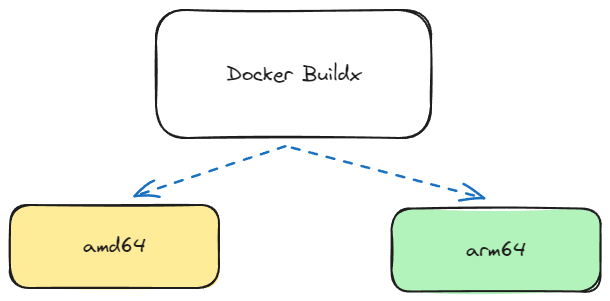
- Deploy
    เมื่อ build เสร็จก็ต้อง deploy ถูกต้องไหมครับ ใน EKS เราสามารถสร้าง Node Group ใหม่โดยใช้ instance type ที่เป็นประเภท Graviton ได้เลย วิธีดูว่า Instance Type ไหนเป็น AWS Graviton ก็คือตัวลงท้ายในประเภทจะเป็นตัว `g` เช่น `t4g.medium`ครับ หลังจากนั้นเราก็ควร taint node group นี้ไว้ด้วยแล้วก็ค่อยไปใส่ toleration ให้ service ที่พร้อมสำหรับการรันบน AWS Graviton ถึงเข้ามาใช้งานได้ครับ
	
	```yaml
	  tolerations:
	  - key: kubernetes.io/arch
	    operator: Equal
	    value: arm64
	    effect: NoSchedule
	```
    
	จริงๆแล้ววิธีการย้าย workload มีค่อนข้างหลากหลายครับ นอกจาก [Taint and Toleration](https://kubernetes.io/docs/concepts/scheduling-eviction/taint-and-toleration/) ก็ยังมี [Node label selector](https://kubernetes.io/docs/concepts/scheduling-eviction/assign-pod-node/) และ [Node affinity](https://kubernetes.io/docs/tasks/configure-pod-container/assign-pods-nodes-using-node-affinity/) อีกด้วย ซึ่งเราสามารถใช้งานร่วมกันเผื่อให้ได้ผลลัพธ์ตามที่ควรจะเป็นได้ครับ
    
    นอกจากการรันให้ถูก node แล้ว เรายังสามารถผสาน technique ที่เกี่ยวกับ [Traffic splitting](https://gateway-api.sigs.k8s.io/guides/traffic-splitting/) ได้อีกด้วย ทำให้เราสามารถลองแบ่ง Traffic จำนวนหนึ่งมารันบน AWS Graviton เพื่อทำการทดสอบอะไรบางอย่างก่อนจะย้ายไปใช้จริง 100% ได้ครับ
	[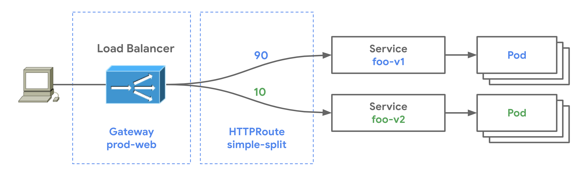](https://gateway-api.sigs.k8s.io/guides/traffic-splitting/)
- Testing
    เราจะรู้ได้ยังไงหล่ะว่าการมาใช้ AWS Graviton ทำให้ระบบเราได้ Performance ที่มากขึ้นและ Latency ลดลงเหมือนที่คนอื่นเขาเล่ากันมา คำตอบคือการทำ Testing ครับ หากว่าระบบเรามี script สำหรับการทำ Smoke Test เราก็สามารถนำมาทดลองรันกับ Service ที่ทำงานอยู่บน AWS Graviton เผื่อ Monitor ผลลัพธ์ได้เลยครับ
    
    อย่างไรก็ตาม การใช้งาน AWS Graviton ไม่ได้หมายความว่าเราจะได้ประสิทธิภาพเพิ่มขึ้นกันตลอดทุกครั้งนะครับ เพราะอย่างที่เรากล่าวกันไปในหัวข้อก่อน ว่าถ้าเวอร์ชั่นของภาษาที่เราใช้ยังไม่ได้ Optimize มาสำหรับ CPU ประเภท ARM อาจจะทำให้ประสิทธิภาพลดลงก็เป็นได้ โดยในส่วนนี้เราสามารถใช้เครื่องมือที่เรียกว่า [Flame Graphs](https://github.com/brendangregg/FlameGraph) มาดู stack frame ของ application ว่ามันช้าลงที่ส่วนไหนเพื่อทำการ optimize เพิ่มเติมได้ครับ
    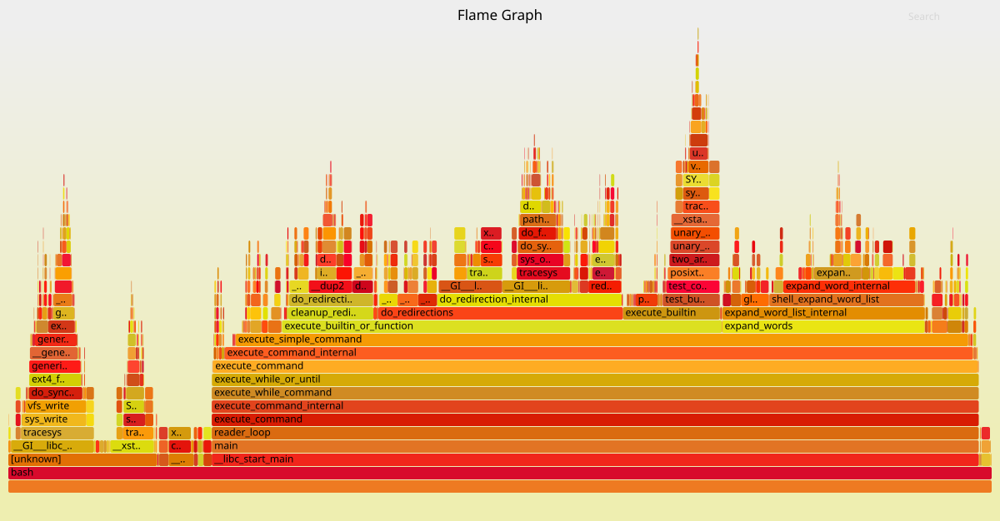

ทั้งหมดนี้ก็เป็นเพียงขั้นตอนคร่าวๆเท่านั้น ทุกคนสามารถเข้าไปอ่านเรื่อง [Transition Guide](https://github.com/docker/buildx#getting-started) เพิ่มเติมเพื่อขั้นตอนและวิธีการวางแผนที่ถูกต้องมากขึ้นครับ

### 3/ Managed Services
นอกจาก workload ของเราเองแล้ว เรายังสามารถใช้งานเจ้า Graviton กับ Managed services ต่างๆของ AWS ได้ด้วยนะ ซึ่งในส่วนนี้เราไม่ต้องทำอะไรเลยครับ สามารถ upgrade แล้วก็ enjoy ได้เลย ลองเข้าไปดูรายละเอียดของแต่ล่ะ [managed services](https://github.com/aws/aws-graviton-getting-started/blob/main/managed_services.md) ที่เราต้องการใช้งานได้เลยครับ

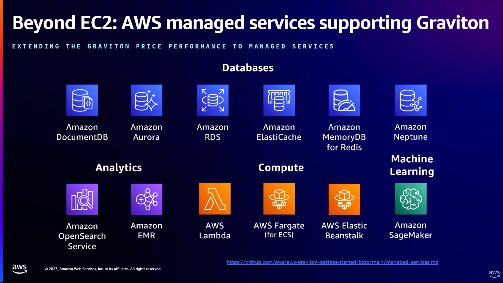

## สรุป
ถ้าหากว่าคุณเริ่มที่จะสนใจ AWS Graviton แล้วล่ะก็ ลองเข้าไปที่ [AWS Graviton Fast Start](https://aws.amazon.com/ec2/graviton/fast-start/) ซึ่งเป็นโปรแกรมสำหรับการย้าย workload ของเรามาอยู่บน AWS Graviton ซึ่งมีตัวอย่างของ Serverless, Container, Database และ Caching ครับ

[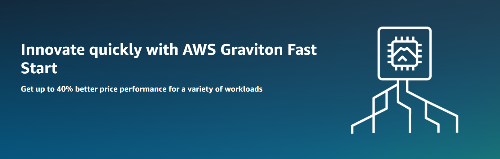](https://aws.amazon.com/ec2/graviton/fast-start/)
ขอพลังของ ARM จงสถิตอยู่กับทุกคนครับ ⚔️
### Continue readings
- [https://github.com/aws/aws-graviton-getting-started](https://github.com/aws/aws-graviton-getting-started)
- [https://docs.aws.amazon.com/whitepapers/latest/aws-graviton2-for-isv/transitioning-your-service-or-application.html](https://docs.aws.amazon.com/whitepapers/latest/aws-graviton2-for-isv/transitioning-your-service-or-application.html) %%