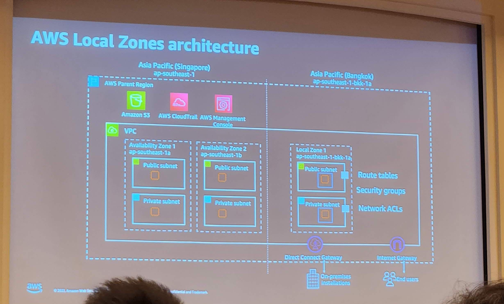
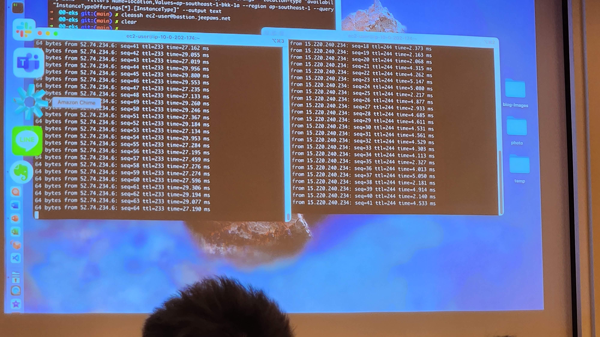
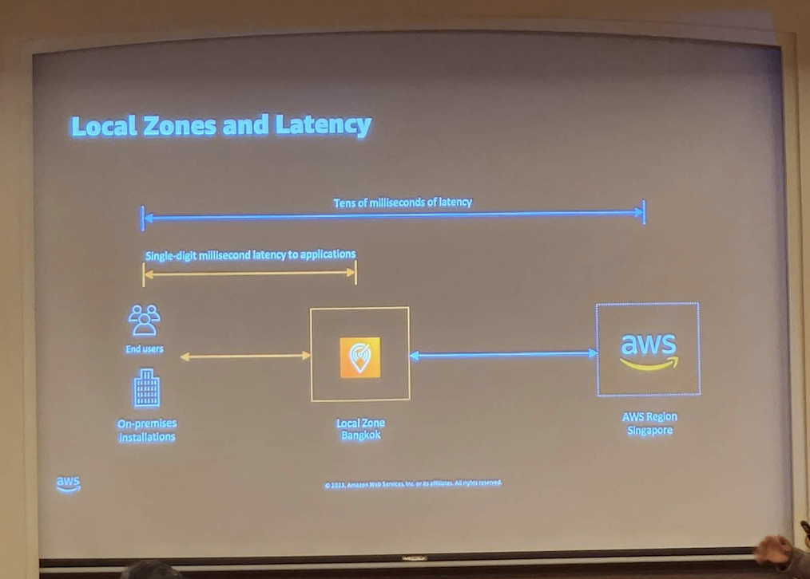
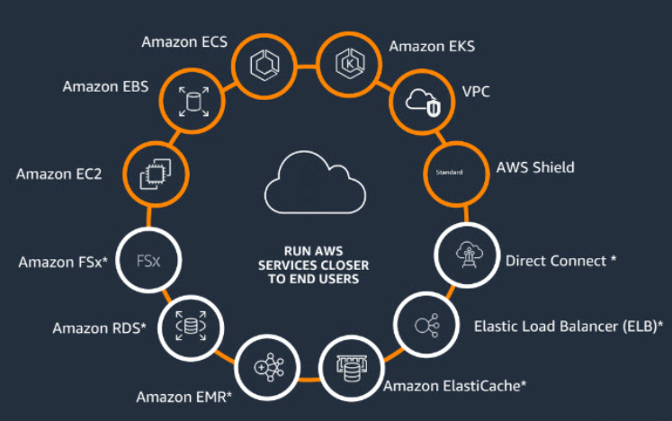
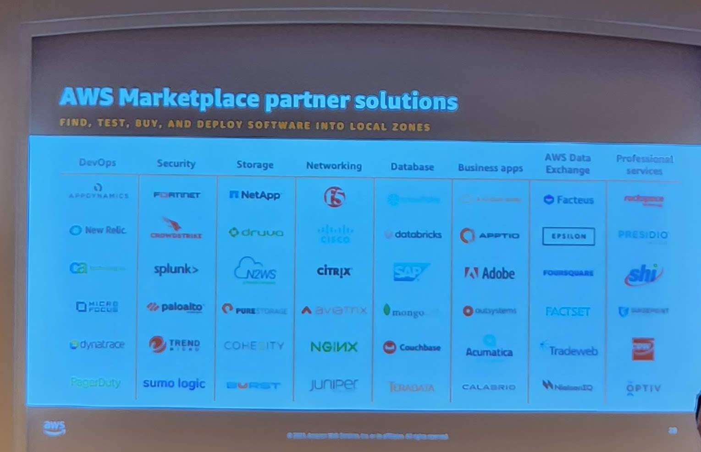
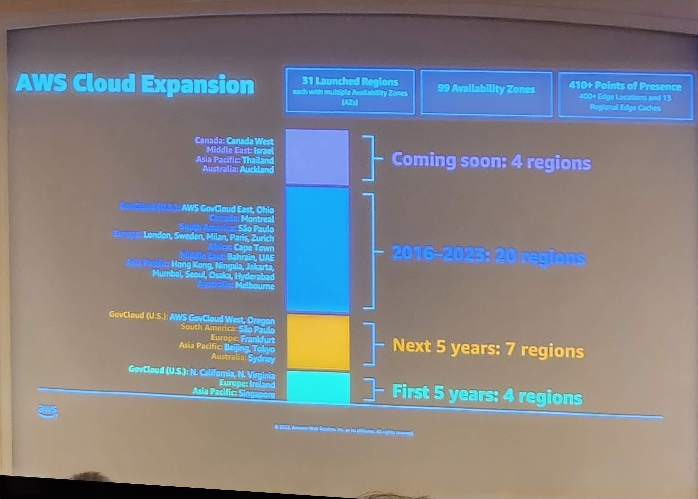
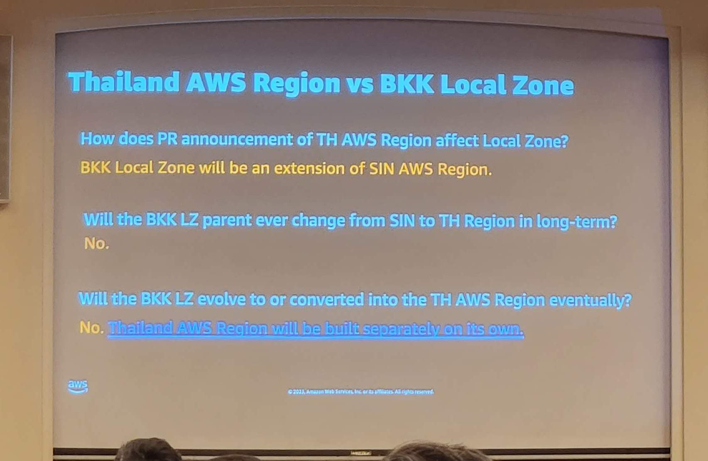
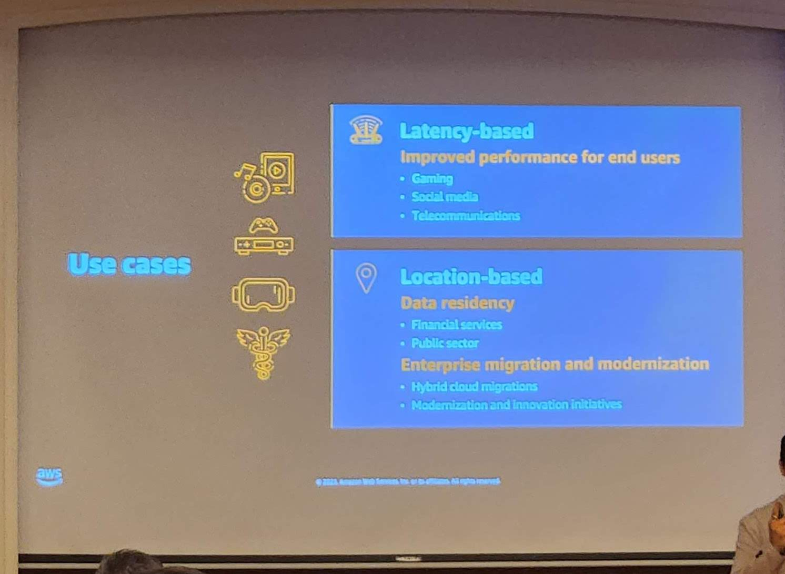
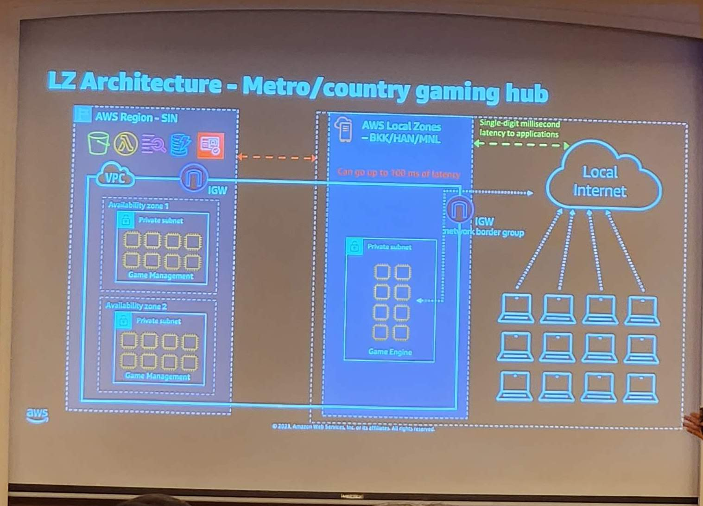

พอดีได้มีโอกาสไปร่วมงานเปิดตัว AWS Bangkok Local zone ที่โรงแรม Anantara Siam Bangkok Hotel เมื่อวันที่ 31 มกราที่ผ่านมา เลยลองสรุปสาระสำคัญจากงานมาฝากครับ

## ทำไมต้อง Local Zone?

เกริ่นก่อนสำหรับคนที่ยังไม่เข้าใจ Local zone มากนัก เอาง่ายๆเลย มันก็คือโซนท้องถิ่นนั่นเอง! อย่าเพิ่งเอ๊ะไป เราลองเข้าไปดูใน [AWS Global Infrastructure](https://aws.amazon.com/about-aws/global-infrastructure/) ได้บอกไว้ว่า Region ประกอบไปด้วย Avaliability zone ซึ่งบ่อยครั้งก็อยู่ห่างจาก User มากเกินไป จึงทำให้เกิด Local Zone ที่มีคุณลักษณะคล้าย Availibility Zone หลายประการ แต่เข้าไปอยู่ใกล้ User มากขึ้นเพื่อรองรับการทำงานที่ต้องการ latency ต่ำนั่นเอง ซึ่ง Bangkok Local Zone ก็ถือเป็น Zone ภายใต้ `ap-southeast-1` หรือ Singapore (อนาคตก็จะไม่ได้อยู่ใน Thailand region นะ)

## Latency ที่ตอบโจทย์

จากรูปของการทดสอบที่ลองสั่ง `ping` ไปยังเครื่องใน `ap-southeast-1` (รูปซ้าย) ที่ใช้เวลาประมาณ 27ms กับฝั่ง local zone (รูปขวา) ประมาณ 4ms จะเห็นได้ว่า local zone ให้ latency ที่ต่ำกว่าประมาณ 6 เท่าเลยทีเดียว!

และเนื่องจาก Bangkok Local zone จะอยู่ภายใต้ Region Singapore จึงใช้ Network backbone เดียวกัน ทำให้เราสามารถติดต่อกับ Service ที่มีตามเดิมใน region ได้ปกติ ไม่ได้วิ่งออก public network แต่อย่างใด

## Services ที่รองรับ

ณ ปัจจุบัน Services ที่พร้อมให้บริการบน Local Zone (วงกลมส้ม) จะยังมีไม่มากแต่ทาง AWS ก็มีแพลนจะเพิ่ม Services ที่สามารถใช้งานบน Local zone ขึ้นอีกในอนาคต (วงกลมขาว)

และถึงแม้ว่า services จะยังไม่มากนัก แต่ก็ค่อนข้างเพียงพอต่อความต้องการในการยกระดับ system ที่มี latency sensitive ให้มี performance ที่มากขึ้นได้ และนอกจาก Services ในข้างต้น เรายังสามารถใช้ AWS Marketplace Partner ภายใน Local zone ได้เหมือน region ปกติอีกด้วย

## ราคาเท่าไหร่กันนะ

พูดกันมาถึงขนาดนี้ หลายๆท่านคงเตรียมเปิด console ไปกดสร้างหรือเตรียมแผนงานย้ายระบบมาอยู่บน Local zone กันเป็นแน่แท้ แต่ก่อนจะไปขั้นนั้น ลองมาดูค่าใช้จ่ายเมื่อเทียบกับ compute ทั่วไปบน region กันก่อน

|EC2 (Region)|EC2 (Local Zone)|
|---|---|---|
|Instance (c5.2xlarge) / hours|$0.392|$0.549|
|EBS (gp2) / GB|$0.12|$0.246|

จะเห็นได้ว่าราคาของ compute บน local zone สูงกว่าบน region ประมาณ 40% เลยทีเดียว นอกจากนี้เรายังเสียค่า Network Transfer ทั้ง In และ Out $0.08/GB อีกด้วย ([ดูราคาเพิ่มเติม](https://aws.amazon.com/th/about-aws/global-infrastructure/localzones/pricing/)) นอกจากราคาที่เพิ่มขึ้นแล้วยังมี Instance Type และ Disk Type ให้เลือกค่อนข้างจำกัด ฉะนั้น เราจะมาพูดคุยถึง Use case ของการนำ Local zone มาใช้ให้เกิดความคุ้มค่าในด้านไหนได้บ้าง ช่วงท้ายของบทความ

## การมาของ Thailand Region

ยังไม่หมดเพียงเท่านั้น ภายในงานยังมีการพูดถึงการมาในอนาคตของ Thailand Region เพราะ AWS ถึงกับทุ่มเงินจำนวน 190 ล้านบาท เพื่อเข้ามาทำ Region ในประเทศไทยกันเลยทีเดียว

และภายในงานยังมีคำถามที่น่าสนใจดังนี้

กล่าวโดยสรุปคือ BKK Local zone จะเป็นส่วนต่อขยายของ Singapore และจะไม่มีอะไรเกี่ยวข้องกับ TH Region ในอนาคต ถึงแม้ว่า TH Region จะเสร็จและพร้อมใช้งาน ก็จะไม่มีการย้าย BKK Local Zone มาที่ TH region แต่อย่างใด

## ใช้ให้ถูกงาน

ลองมาดูตัวอย่างหรือ Use case การนำ Local zone มาใช้เพื่อให้เกิดประโยชน์กันดีกว่า

- **Game**
    
    - ตัวอย่างจากค่ายเกม Supercell เจ้าของเกมยอดนิยมอย่าง Clash of Clans ที่ต้องการให้บริการ Game Server ให้ผู้เล่นมี latency ที่ต่ำเพื่อให้ได้รับประสบการณ์การเล่นเกมที่ดีมากยิ่งขึ้น
        
- **Content creation**
    
    - อันนี้ยกตัวอย่างถึงบริษัท Netflix ที่มีการเอา Local zone ไปให้บริการสำหรับ service ที่ run latency sensitive เช่นการ live production video editing ให้ใกล้กับเหล่า artist มากยิ่งขึ้น
        
- **Remote broadcasting**
    
    - Esports Engine สามารถพัฒนาระบบที่มี latency ต่ำและมี performance ที่ดีขึ้นสำหรับการ broadcasting video ด้วยการวาง AWS Local zone ให้ใกล้กับผู้ใช้งาน พร้อมทั้งสามารถ scale ไปสู่ Global ได้ทันทีอีกด้วย
        

## สรุป 🗒️

สำหรับองค์กรที่คิดจะกระโดดเข้ามาสู่การใช้ Bangkok Local zone จะต้องมี Use case ที่เหมาะสม เพราะนอกจากจะมีราคาที่มากกว่าเดิมแล้ว Service หลายๆตัวก็ยังไม่พร้อมให้บริการ ณ ขณะที่เขียนบทความนี้ แต่ก็ถือว่าเป็นสิ่งที่น่าสนใจมาก ที่จะนำมาช่วยพัฒนาระบบที่ต้องการ latency ที่ต่ำเพื่อให้ได้ performance ที่มากขึ้น ใครต้องการจะทดสอบก็สามารถลองทำตาม[บทความ](https://aws.amazon.com/th/blogs/thailand/aws-local-zones-bangkok-%E0%B8%9E%E0%B8%A3%E0%B9%89%E0%B8%AD%E0%B8%A1%E0%B9%83%E0%B8%AB%E0%B9%89%E0%B8%9A%E0%B8%A3%E0%B8%B4%E0%B8%81%E0%B8%B2%E0%B8%A3%E0%B9%81%E0%B8%A5%E0%B9%89%E0%B8%A7/)จาก AWS ได้เลย

ถ้าชอบก็อย่าลืมกดติดตามบทความถัดๆไปด้วยนะ ขอบคุณครับ 🙇🏻‍♂️
