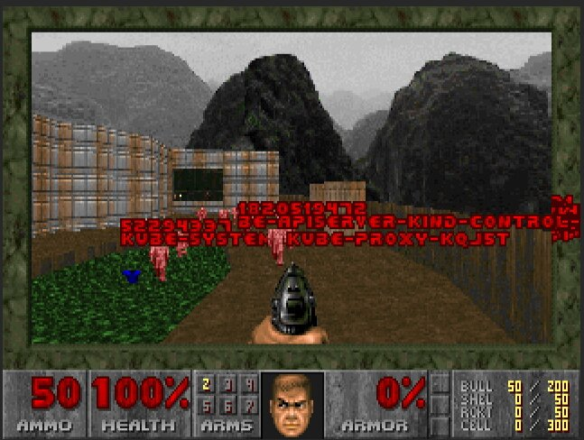
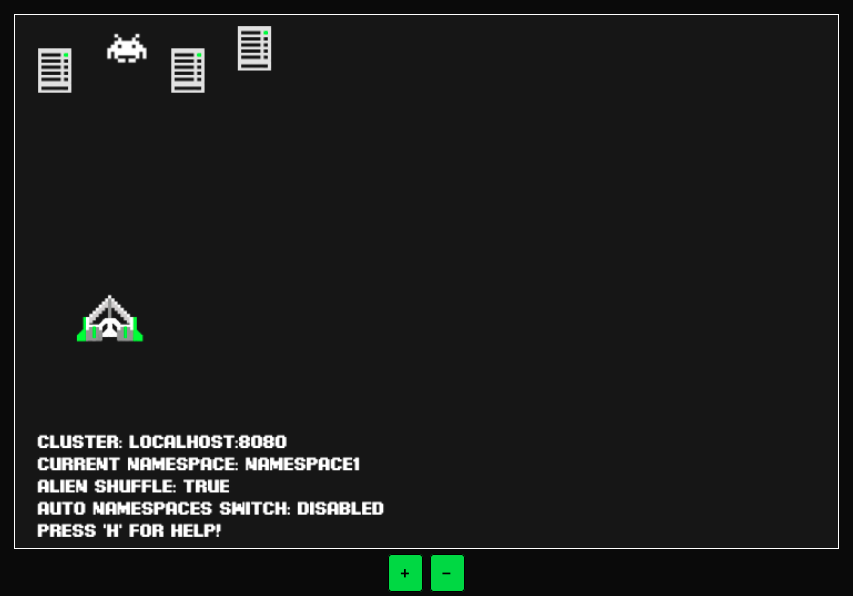

> _disclaimer: This post focuses on how fun chaos engineering can be. This does not cover the principal and real practicalities of chaos engineering._

## What is Chaos Engineering?

> Chaos engineering is the process of testing a distributed computing system to ensure that it can withstand unexpected disruptions. It relies on concepts underlying chaos theory, which focuses on random and unpredictable behavior.
> 
> [TechTarget](https://www.techtarget.com/searchitoperations/definition/chaos-engineering)

The meaning is relatively straightforward, In short, It's is "rude to your cluster and hope it can survive". But the real world of Chaos Engineering has a lot of topics for measuring the metrics that you can ensure your experiment runs successfully or not.

Leave it behind, Because in this article we will talk only about the **FUN** part of chaos engineering, But it might not be fun for everyone 🤣

## What is Gamification?

> The practice of making **activities** more like **games** in order to make them more interesting or **enjoyable.**
> 
> [Cambridge Dictionary](https://dictionary.cambridge.org/dictionary/english/gamification)

For example, In the classroom, the teacher can give you a point that you can use to exchange with a special score or some benefits like gaining more time to do the homework than other people and the point will give to the student that participated and answers in the classroom. Does it sound like the game?

## Ready for the fun?

The formula is -> `Chaos engineering + Gamification = Fun (Maybe)!`

To make it fun, We need to make the process more like a game. That you can play a game while doing the chaos engineering at the same time.

A lot of the interesting projects to make chaos engineering more fun has created on GitHub, Thanks for the open sources.

Are you ready? Let's get started.

> ⚠️ Warning: Do with your own risk!

### 1. Kube Doom

> KubeDoom is The next level of chaos engineering! Kill pods inside your Kubernetes cluster by shooting them in Doom! - [KubeDoom](https://github.com/storax/kubedoom)

### 2. KubeInvaders

> Gamified Chaos Engineering Tool for Kubernetes - [KubeInvaders](https://github.com/lucky-sideburn/KubeInvaders)

### 3. Kube Chaos

> A chaos engineering style game where you seek out and destroy Kubernetes pods, twinstick shmup style - [Kube Chaos](https://github.com/Shogan/kube-chaos)

[119267327-07a41c80-bbe6-11eb-87ec-25ee0f96e669.mp4](https://user-images.githubusercontent.com/814180/119267327-07a41c80-bbe6-11eb-87ec-25ee0f96e669.mp4)
## Summary

These are the example projects that I found to make chaos engineering fun. If you find more interesting projects please tell me. But also please note that this is not the real principle of chaos engineering. It's just fun to implement the game with some chaos engineering concepts. To make it right, You need to understand more in the context of what you are doing and experiment for the result that you are looking for to improve the durability of your system.

Have fun! and see you in the next post.
