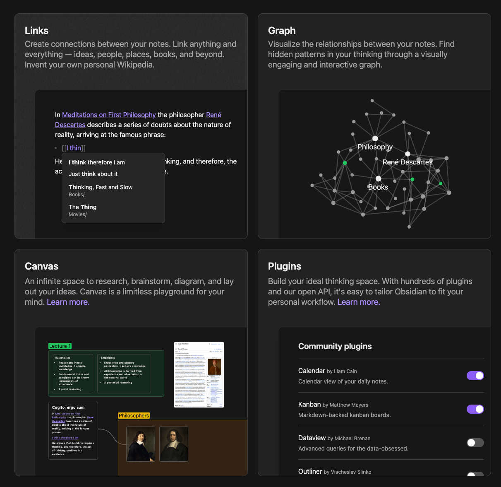
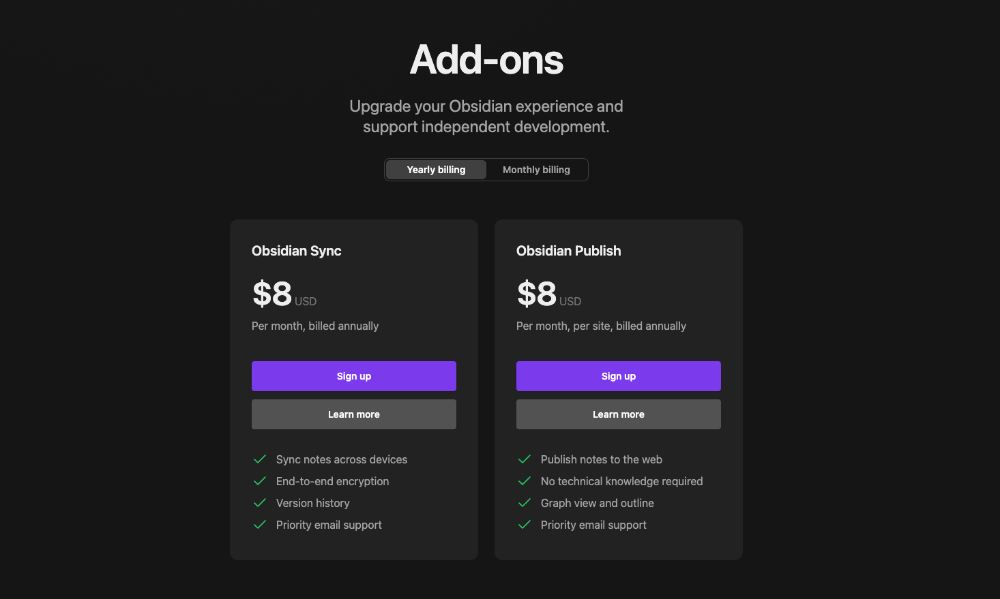
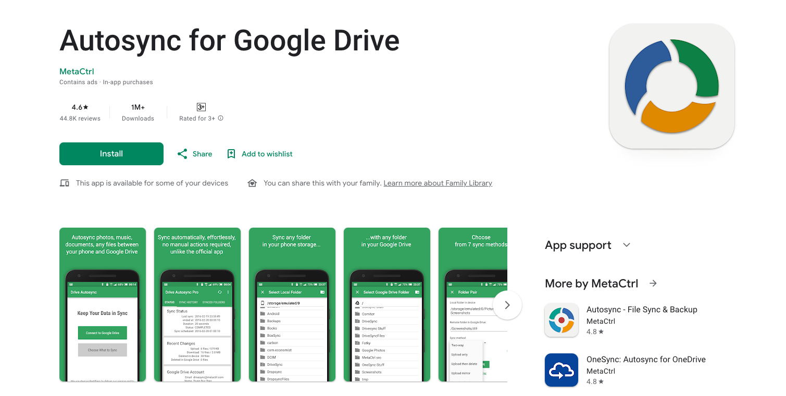
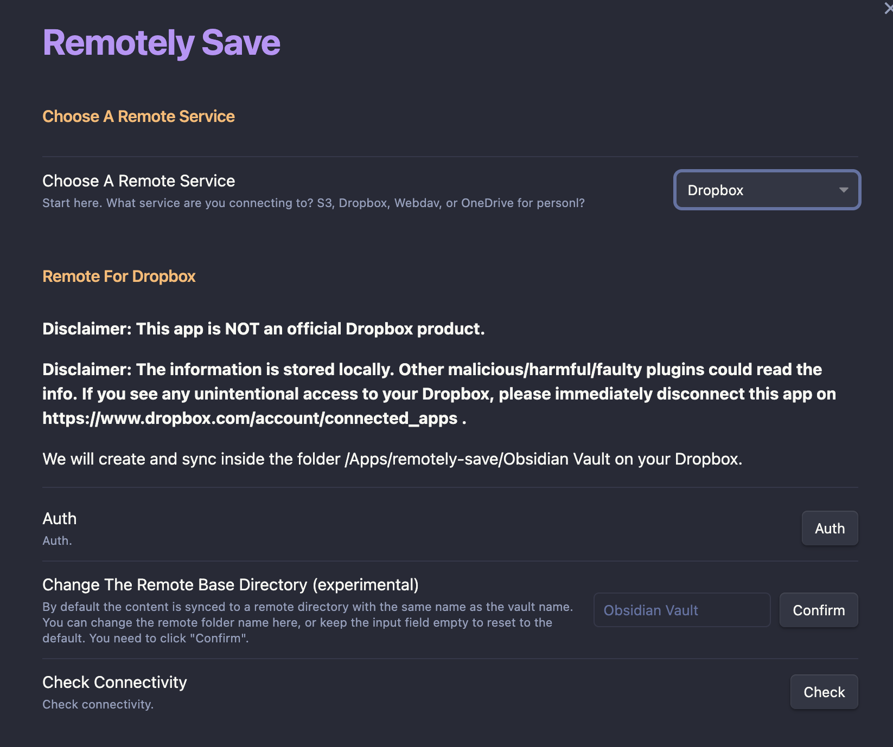
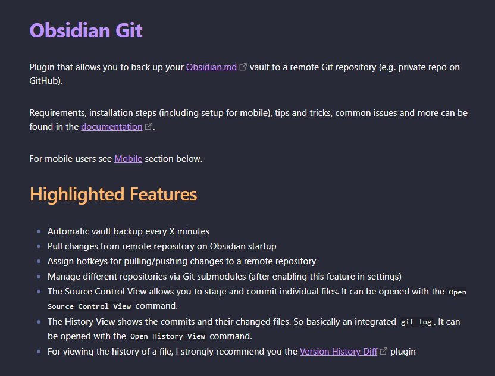
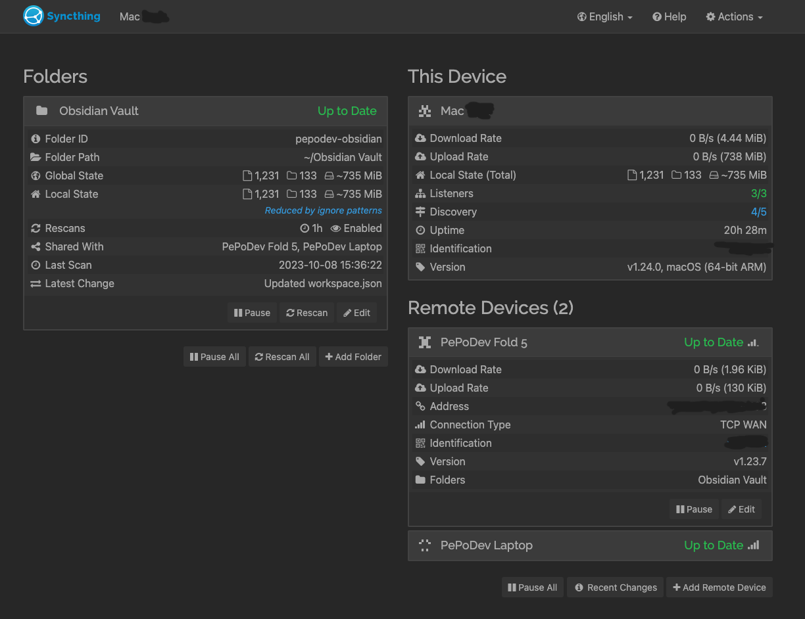
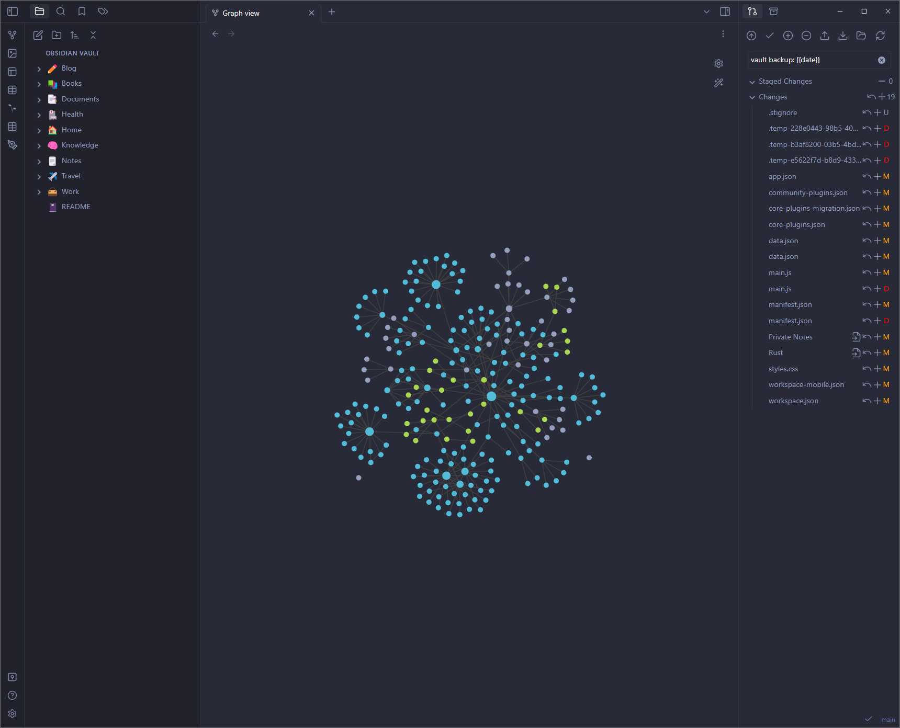

## เกริ่นนำกันซักนิด
ถ้าหากคุณหลงเข้ามาโดยที่ยังไม่รู้ว่าเจ้า [Obsidian](https://obsidian.md/) คืออะไร เราขอสรุปสั้นๆว่า Obsidian ก็คือ Note taking เจ้านึงที่เน้นเรื่อง Privacy first หรือก็คือ note ของเรา เราดูแลเอง บวกกับการจด Note ในแบบที่ Developer ชอบก็คือ Markdown style นั่นเอง เท่านั้นยังไม่พอ community ยังช่วยกันทำ plugin เพื่อให้เจ้า Obsidian มีความสามารถที่มากขึ้น ถือเป็น note taking app ที่มี feature ที่หลากหลาย ทำงานแบบ offline ได้ ที่สำคัญ ทั้งหมดที่กล่าวมานั้น ฟรี!!!!!!!!

แต่เดี๋ยวก่อน ถึงแม้จะบอกว่าโปรแกรมนี้ฟรี แต่ก็มีจุดที่เขาหารายได้อยู่เหมือนกันด้วยการขายบริการหรือ add-ons แยกเพื่อใช้คู่กับ Obsidian ซึ่งมีอยู่สองส่วน ส่วนแรกก็คือระบบของการ Publish ที่จะช่วยให้เราสามาระแชร์ Note ของเราออกมาเป็น Link ที่สามารถเปิดดูได้ผ่าน Internet และส่วนที่สองคือการ Sync ที่จะช่วยให้โน๊ตของเราเหมือนกับ device เครื่องอื่นๆ เช่นแก้จากคอมไปดูในมือถือเป็นต้น

ตอนนี้เราอาจจะมีคำถามว่า แล้วถ้าไม่อยากจ่ายเงินหล่ะ ไหนบอกฟรี? โอเค ไม่เป็นไร ผมมีข่าวดีสำหรับสาย Apple ทุกท่านก็คือ iCloud ใน iOS มัน mount file system ลงในเครื่องให้เลย ทำให้เราเปิด vault ของเราบน iCloud drive ได้ทั้งใน Mac แล้วก็ iPhone และ Sync กันได้เลยโดยที่ไม่ต้องทำอะไร แต่สำหรับสาย Android อย่างกระผมนั้นก็ไม่ต้องน้อยใจกันไป ตามมาดูวิธีต่างๆที่เราสามารถทำได้กัน

เป็นที่แน่นอนว่าถ้ามีระบบ plugin หรือการเก็บโน๊ตของเราลงบนเครื่องเราเองอยู่แล้ว เราย่อมมีทางเลือก ซึ่งวันนี้เราจะมาเสนอสี่ทางเลือกที่จะช่วยให้เราสามารถใช้งาน Obsidian บนหลายๆ device ได้พร้อมๆกัน (Publish ก็ทำแบบฟรีๆได้นะ แต่วันนี้เราจะมาโฟกัสกับการ Sync กันก่อน) เริ่มกันที่วิธีแรก
### 1/ **Autosync**
วิธีแรกคือการใช้ Cloud Storage อย่าง Google Drive เข้ามาช่วย Sync ข้อมูลให้เราโดยที่ใน PC หรือ Laptop เราก็ลงพวก File sync ของ Cloud ใดก็ได้ที่เราชื่อชอบ เช่น [Google Drive for Desktop](https://www.google.com/drive/download/) หลังจากนั้นก็ใช้แอพ [AutoSync](https://play.google.com/store/apps/details?id=com.ttxapps.drivesync) เข้ามาช่วย sync ข้อมูลเหล่านั้นมาลงบนโทรศัพท์ของเราได้เลย

สำหรับวิธีนี้ การตั้งค่าจะค่อนข้างง่าย เพียงแค่ login กับทาง Google Drive ทั้งสองอุปกรณ์ของเรา ตัว folder ก็จะเริ่ม Sync กันโดยอันตโนมัติ เพียงแต่ข้อเสียของวิธีคือมันไม่ real-time เพราะเราต้องตั้ง interval ว่าจะให้มันทำการ Sync ทุกๆกี่นาที ซึ่งถ้าเราตั้งถี่มากๆก็หมายถึง Battery ที่จะโดนสูบเข้าไปมากเช่นกัน หรือถ้าเราต้องการ sync มาทันทีก็ต้องมากด sync เองแบบ manual ครับ นอกจากแอพ AutoSync ก็ยังมีอีกเจ้านึงที่ชื่อ [FolderSync](https://play.google.com/store/apps/details?id=dk.tacit.android.foldersync.lite) สามารถไปลองโหลดมาทดสอบกันดูได้เลยครับ

นี่ก็จบกันไปแล้วกับวิธีแรก ซึ่งถ้าหากว่าวิธีแรกมันง่ายไป เชิญคุณอ่านต่อไปได้เลยครับ แต่ถ้ามันยากไปคุณอาจจะต้องทบทวนว่าจะจ่ายเงินให้ Obsidian ดีไหมแทนแล้วหล่ะ เพราะหลังจากนี้จะเริ่มยากขึ้น และใช้ความรู้ทางด้านสายงาน IT พอสมควร ซึ่งจะมีความเสี่ยงต่อการสูญหายของข้อมูลด้วย หากคุณจัดการมันได้ไม่ดีพอ ถ้าคุณอ่านแล้วยังไม่กลัว ก็เชิญไปที่วิธีถัดไปได้เลยครับ
### 2/ Remotely Save (Plugin)

อย่างที่กล่าวไปในตอนต้นว่า Obsidian เปิด API ให้นักพัฒนาสามารถเข้าไปทำ plugin เพื่อเสริมความสามารถได้เต็มที่ เลยทำให้มีคนทำ plugin ที่ชื่อว่า [Remotely Save](https://github.com/remotely-save/remotely-save) ที่สามารถ Sync note ของเราเข้ากับ Cloud services ต่างๆได้ ซึ่งในปัจจุบันก็รองรับ S3, Dropbox, Webdav และ OneDrive ซึ่งการใช้งานก็เพียงแค่ติดตั้งและทำการ connect plugin เข้ากับ cloud service ที่เราต้องการก็เป็นที่เรียบร้อยแล้ว ที่เหลือเราก็เลือกได้เลยว่าต้องการให้ Sync ทุกๆกี่นาที หรือให้ทำการ Sync ทุกครั้งที่เปิดแอพขึ้นมาก็ได้เช่นกัน

เราอาจจะสังเกตว่าจะเริ่มมีคำเตือนมากขึ้นเมื่อเราเริ่มที่จะใช้ plugin เพราะการ Sync note ของเราระหว่างเครื่องอื่นๆก็คือการเขียนทับ ลบไฟล์ต่างในเครื่องของเรา ดังนั้นหากคุณหรือตัว plugin เองทำบางอย่างผิดพลาดไป ก็อาจจะเกิดการสูญหายของข้อมูลได้เช่นกัน ดังนั้นเราเลยต้องมีวิธี backup ข้อมูลของเราเช่นกัน
### 3/ Git (Plugin)
อันนี้อาจจะไม่เชิง sync ซะทีเดียว แต่เรายังสามารถใช้เผื่อ backup vault ของเราได้อีกด้วย เพราะ Git ก็คือ version control system ตัวนึงที่ทำให้เราสามารถติดตามการเปลี่ยนแปลงของไฟล์เราได้ การใช้งาน plugin นี้ก็เหมือนวิธีก่อนหน้าเลยครับ เข้าไปติดตั้ง plugin `Obsidian Git` แล้วก็ทำการ enable กับ config ให้เรียบร้อยก็จะใช้งานได้ทันทีครับ ซึ่ง plugin ตัวนี้สามารถตั้งค่าได้ครอบคลุมการใช้งานที่หลากหลายมากๆ เช่นให้ backup แล้ว push ไปที่ remote repository ของเรา ในทุกๆเสลาที่เรากำหนดหรือทุกครั้งที่เราเปิดโปรแกรมขึ้นมา หรือคอย pull ดูอยู่เรื่อยๆว่ามีอัพเดตอะไรมาใหม่หรือไม่ แต่เนื่องด้วยความที่ Git เป็นความรู้เฉพาะทาง ทำให้การตั้งค่าในโทรศัพท์มือถือก็มีขั้นตอนที่เพิ่มขึ้นมาไม่น้อยเช่นกัน การขาดความเข้าใจอาจจะทำให้ข้อมูลหลุดหรือสูญหายได้เลยทีเดียว ฉะนั้นหากคุณไม่ได้เข้าใจว่า Git คืออะไรก็ขอให้ข้ามมันไปก่อนล่ะกันครับ

### 4/ Syncthing
เข้าสู่ดาวเด่นของงานในวันนี้ ซึ่งเป็นวิธีที่ผมชอบมากที่สุดเลยก็ว่าได้ เพราะเจ้าตัว Syncthing มันทำงานแบบ real-time ทำให้เมื่อเราแก้ไฟล์ที่ laptop ของเรา โทรศัพท์ก็จะเห็นการเปลี่ยนแปลงนั้นแบบไวมากๆ เรียกว่ามีข้อดีเต็มไปหมด แต่ก็ใช่ว่าจะไม่มีข้อเสีย ข้อเสียหลักๆของ Syncthing นั่นก็คือการที่ตัวมันเป็นอีกโปรแกรมนึงเลยที่เราต้องดูแลและตั้งค่ามัน เพราะแท้จริงแล้ว Syncthing เป็นเพียงโปรแกรมที่เอาไป sync ไฟล์ระหว่างสองเครื่อง ไม่ได้มีส่วนเกี่ยวข้องอะไรกับ Obsidian แต่อย่างใด ซึ่งในการใช้งานเราจะต้องทำการเพิ่ม remote devices ให้อุปกรณ์ของเรารู้จักกันเสียก่อน หลังจากนั้นเราจึงสามารถ share folder ของเราไปให้อุปกรณ์อื่นได้ และข้อมูลระหว่างสองอุปกรณ์ก็จะ sync กันอยู่เสมอตราบเท่าที่โปรแกรม Syncthing ยังคงทำงานอยู่ครับ และการใช้งานโปรแกรมนี้ก็ควรระมัดระวังเรื่องของการตั้งค่าให้ดีเพราะค่อนข้างเฉพาะทางมากๆครับ

หากคุณสนใจก็ลองอ่านเรื่อง[ความปลอดภัย](https://docs.syncthing.net/users/security.html)ของเจ้าโปรแกรมตัวนี้ดูก่อนได้ แล้วก็ค่อยๆอ่าน document ในส่วนที่เราสงสัยตามไปเรื่อยๆครับ เมื่อเข้าใจพื้นฐานของมัน โปรแกรมนี้ก็เป็นอีกเครื่องมือที่ประยุกต์ใช้ในสถานการณ์อื่นๆได้ดีเช่นกันครับ
## สรุป
หลังจากที่เราเต็มอิ่มกับวิธีทั้งหมดที่มีกันไปแล้ว หากเพื่อนๆมีวิธีอื่นที่น่าสนใจก็ comment บอกกันได้เลยครับ ซึ่งจากที่เราเห็นบางวิธีก็ง่าย แต่ก็อาจจะไม่ได้ตามที่เราต้องการ หรือบางวิธีที่ดูจะได้ตามสิ่งที่เราต้องการก็ดูยากเย็นเหลือเกินกว่าจะได้มันมา ถ้าทำไม่ดี หรือทำอะไรผิดไปบางขั้นตอนก็อาจเป็นเหตุให้ข้อมูลสูญหายกันได้อีกด้วย ฉะนั้นการจ่างเงินในบางครั้งก็ดูเป็นทางออกที่ไม่เลวครับ 😅

ถ้าคุณชอบบทความแบบนี้ อย่าลืมกดติดตาม เพื่อรับการแจ้งเตือนบทความถัดไปด้วยนะครับ 🙇🏻‍♂️

## References
- [https://help.obsidian.md/Getting+started/Sync+your+notes+across+devices](https://help.obsidian.md/Getting+started/Sync+your+notes+across+devices)
